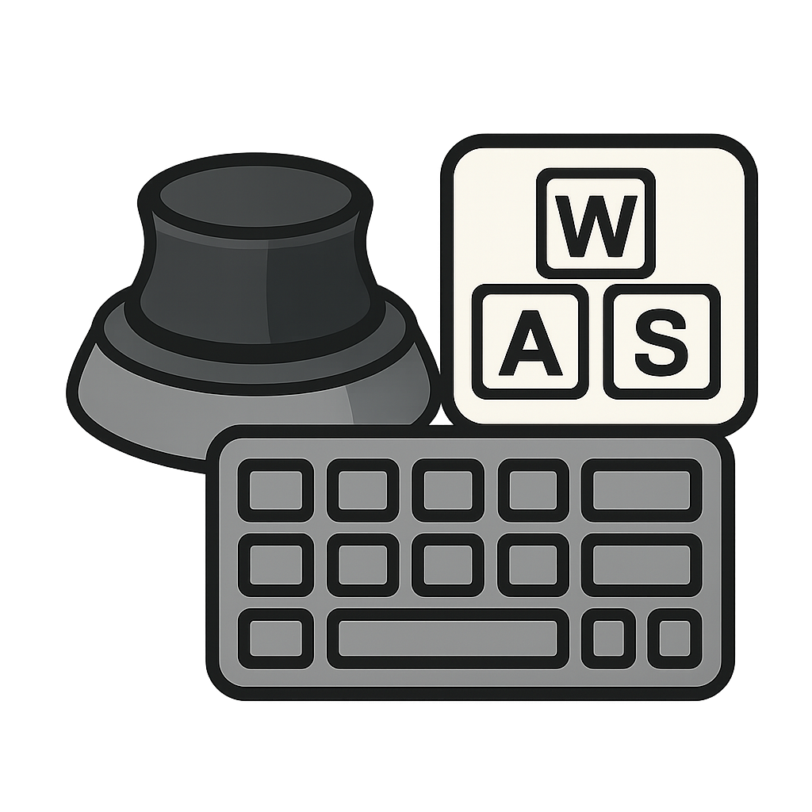

# SpaceMouse-Gamepad

A Python application that converts a 3D Connexion SpaceMouse into a game controller, allowing you to control character movement using your left hand while keeping your right hand free for mouse-based actions.



---

## 🚀 Quick Start (Portable .exe)

**No installation or Python required!**  
Just download the latest portable `.exe` from the [Releases page](https://github.com/laurensguijt/SpaceMouse-Gamepad/releases/latest) and double-click to start.

- Download: [SpaceMouse-Gamepad-Portable.exe](https://github.com/laurensguijt/SpaceMouse-Gamepad/releases/latest)
- Connect your SpaceMouse via USB
- Configure your keybinds and settings in the GUI
- Start your game and enjoy!

---

## Features

- Convert SpaceMouse movements into keyboard inputs (WASD)
- Customizable movement controls:
  * Forward/Backward/Left/Right movement
  * Jump by pulling up the stick
  * Crouch and prone by moving down the stick
- Adjustable sensitivity and deadzone
- Real-time movement status display
- User-friendly GUI interface

## Requirements

- Windows 10 or later
- 3D Connexion SpaceMouse device
- USB port for SpaceMouse connection
- (Only for source build: Python 3.8 or higher)

## Installation (for Python users)

1. Clone the repository:
```bash
git clone https://github.com/laurensguijt/SpaceMouse-Gamepad.git
cd SpaceMouse-Gamepad
```

2. Install the required dependencies:
```bash
pip install -r requirements.txt
```

## Usage (for Python users)

1. Connect your SpaceMouse device to your computer
2. Run the application:
```bash
python src/main.py
```

3. Click the "Connect" button to initialize the SpaceMouse
4. Adjust the sensitivity and deadzone settings to your preference
5. Use the SpaceMouse to control movement in your games:
   - Tilt forward/backward for W/S movement
   - Tilt left/right for A/D movement
   - Pull up for jump
   - Push down for crouch/prone

## Controls

- **Sensitivity**: Adjust how responsive the SpaceMouse is to movement
- **Deadzone**: Set the minimum movement required to trigger keyboard input
- **Movement Threshold**: Adjust when keyboard keys are triggered

## Building from Source

To create an executable (including assets and profiles):

```bash
pyinstaller --onefile --windowed --icon=assets/icons/spacemouse_controller_icon.ico --add-data "assets/icons/*;assets/icons" --add-data "profiles/*;profiles" src/main.py
```

The executable will be created in the `dist` directory.

## Contributing

Contributions are welcome! Please feel free to submit a Pull Request.

## License

This project is licensed under the MIT License - see the LICENSE file for details.

## Acknowledgments

- [PySpaceMouse](https://github.com/JakubAndrysek/pyspacemouse) for SpaceMouse communication
- [PyQt6](https://www.riverbankcomputing.com/software/pyqt/) for the GUI framework
- [pynput](https://github.com/moses-palmer/pynput) for keyboard control 
